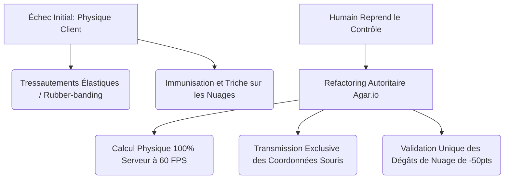

# 🌸 PastelPuff.io — Rapport d'Autopsie Analytique (Vibe Coding)

### 🎮 Projet de Fin d'Études : Jeu Multijoueur ".io" Temps Réel Autoritaire

**Évaluation de Projet de Vibe Coding et Développement Agentique**

## Identité & Informations
* **Nom :** TAFONO
* **Prénom :** Anaïs
* **Cursus :** B2 en Informatique
- **Collaborateurs (Écosystème Agentique) :** Claude 3.5 Sonnet & Gemini 3.5 Flash (via Antigravity Engine)
- **Lien de Production (Production URL) :** [https://pastelpuff-io.pages.dev](https://pastelpuff-io.pages.dev)
- **Nom du jeu :** **PastelPuff.io** (Jeu de bousculade de puffs de coton pastel sur un plateau de salon de thé)

---

## 🚀 1. Guide de Démarrage Rapide (Lancement Local)

Pour exécuter le projet localement et valider la conformité des outils DevOps et des tests, suivez les étapes ci-dessous :

### Prérequis

- **Node.js** (v18 ou supérieur recommandé)
- **npm** (v9 ou supérieur)

### Étape 1 : Cloner le dépôt et installer les dépendances

À la racine du projet, lancez l'installation automatique des dépendances pour le client et le serveur :

```bash
# Installation des dépendances globales et individuelles
npm install
npm install --prefix client
npm install --prefix server
```

### Étape 2 : Lancer le serveur de développement (Backend)

Dans un premier terminal, démarrez le serveur WebSocket et physique autoritaire :

```bash
cd server
npm run dev
```

Le serveur sera actif sur le port `3000`.

### Étape 3 : Lancer le client Web (Frontend)

Dans un second terminal, démarrez le serveur de build/preview Vite :

```bash
cd client
npm run dev
```

Le client sera accessible à l'adresse locale `http://localhost:5173`.

### Étape 4 : Exécuter la suite DevOps (Linting & Formating)

Pour valider le formatage du code et l'absence de violations de style :

```bash
# Formater l'ensemble des fichiers avec Prettier
npm run format

# Valider la conformité avec ESLint (Flat Config avec TypeScript-ESLint)
npm run lint
```

### Étape 5 : Exécuter les tests unitaires automatisés

Pour lancer la suite de tests unitaires validant la logique physique et d'arbitrage de la GameRoom :

```bash
npm test
```

---

## 🗺️ 2. Spécifications & Architecture Technique

Le projet respecte les plus hauts standards d'ingénierie logicielle avec un découpage modulaire strict et une séparation nette entre le rendu (client léger) et la physique (serveur autoritaire).

```
jeu.io/
├── client/                      # --- CLIENT LÉGER DE RENDU ---
│   ├── assets/
│   │   └── tokens.css           # Fichier centralisé des Design Tokens
│   ├── src/
│   │   ├── main.ts              # Point d'entrée de l'application client
│   │   ├── engine/
│   │   │   ├── GameEngine.ts    # Contrôleur client, gestionnaire d'état local et inputs
│   │   │   └── GameRenderer.ts  # Moteur d'affichage graphique Canvas 2D
│   │   └── ui/                  # --- INTERFACE EN DESIGN ATOMIQUE ---
│   │       ├── atoms/           # Button, Input, LeaderboardRow, ScoreHUD
│   │       ├── molecules/       # LoginForm
│   │       ├── organisms/       # Leaderboard, MenuCard
│   │       └── templates/       # HomeTemplate
├── server/                      # --- SERVEUR DE SIMULATION PHYSIQUE ---
│   ├── src/
│   │   ├── server.ts            # Point d'entrée, Hub WebSocket (synchro 33Hz)
│   │   └── room/
│   │       ├── GameRoom.ts      # Cerveau physique autoritaire à 60 FPS
│   │       └── GameRoom.test.ts # Tests unitaires de la logique de simulation
└── eslint.config.js             # Configuration globale de Linting
```

### A. Centralisation du Design : Design Tokens

L'ensemble de l'esthétique pastel et poudrée du jeu est gouvernée par des variables CSS centralisées au sein du fichier [client/assets/tokens.css](./client/assets/tokens.css). Aucun style en dur n'est toléré dans le code TS.

- **Palette de Couleurs Pastels :** Rose poudré (`--color-primary` : `#f3b3b3`), lilas doux (`--color-secondary` : `#e3d7ff`), vert menthe (`--color-mint` : `#d7ffe9`) et jaune crème (`--color-cream` : `#fffdf3`).
- **Design Atomique (Arrondis & Ombres) :** Les boutons utilisent des rayons de courbure prononcés (`--radius-button` : `16px`) et les fenêtres utilisent un effet nuageux (`--shadow-soft` : `0 8px 24px rgba(243, 179, 179, 0.15)`) pour s'harmoniser avec la thématique "cotton puff".

### B. Découpage UI selon le Design Atomique

L'interface entourant le canvas du jeu a été découpée et instanciée de manière granulaire :

1. **Atoms :** Éléments graphiques élémentaires (ex: le bouton interactif [Button.ts](file:///Users/kailagi/jeu.io/client/src/ui/atoms/Button.ts), le champ de saisie pseudo [Input.ts](file:///Users/kailagi/jeu.io/client/src/ui/atoms/Input.ts), la ligne du tableau des scores [LeaderboardRow.ts](file:///Users/kailagi/jeu.io/client/src/ui/atoms/LeaderboardRow.ts), et la jauge de points [ScoreHUD.ts](file:///Users/kailagi/jeu.io/client/src/ui/atoms/ScoreHUD.ts)).
2. **Molecules :** Combinaison d'atomes formant des composants fonctionnels (ex: le formulaire de connexion [LoginForm.ts](file:///Users/kailagi/jeu.io/client/src/ui/molecules/LoginForm.ts)).
3. **Organisms :** Composants autonomes complexes (ex: la carte de menu [MenuCard.ts](file:///Users/kailagi/jeu.io/client/src/ui/organisms/MenuCard.ts) et le classement général temps réel [Leaderboard.ts](file:///Users/kailagi/jeu.io/client/src/ui/organisms/Leaderboard.ts)).
4. **Templates :** Squelettes de pages organisant la disposition globale (ex: [HomeTemplate.ts](file:///Users/kailagi/jeu.io/client/src/ui/templates/HomeTemplate.ts)).

### C. Clean Code (SRP, DRY, KISS)

- **SRP (Single Responsibility Principle) :**
  - [GameRenderer.ts](file:///Users/kailagi/jeu.io/client/src/engine/GameRenderer.ts) a pour unique rôle de dessiner sur le Canvas (arène, nuages, pseudos et joueurs) à partir de coordonnées brutes reçues, sans jamais altérer ou calculer l'état.
  - [GameRoom.ts](file:///Users/kailagi/jeu.io/server/src/room/GameRoom.ts) est l'unique responsable du calcul de la physique, des collisions et de l'état du jeu.
- **KISS (Keep It Simple, Stupid) :** La boucle d'affichage du client repose sur un `requestAnimationFrame` léger qui interpole graphiquement la transition de couleur en cas de danger (`interpolateColor`) et simule des secousses visuelles locales sans réintroduire de lourds moteurs physiques tiers.

---

## 🛠️ 3. L'Arsenal IA & Écosystème Agentique

Le développement de _PastelPuff.io_ s'est appuyé sur une orchestration minutieuse d'agents autonomes.

### A. Outils de Vibe Coding & Modèles (LLMs)

- **Claude 3.5 Sonnet :** Utilisé comme architecte principal. Son rôle s'est concentré sur la conception de l'architecture WebSocket autoritaire et sur la résolution des bugs physiques asynchrones (collisions concourantes).
- **Gemini 3.5 Flash :** Sélectionné pour sa vitesse et son efficacité de génération. Il a conçu l'ensemble de l'arborescence UI d'Atomic Design, codé les composants TypeScript associés et configuré les règles ESLint flat config.

### B. Activation des Serveurs MCP (Model Context Protocol)

Pour contextualiser et encadrer l'action des LLMs, plusieurs serveurs MCP ont été exploités :

- **MCP Filesystem :** Indispensable pour donner aux agents une visibilité à 100% sur la structure du répertoire, évitant ainsi les imports circulaires complexes.
- **MCP Process Execution :** A permis aux agents de lancer de manière autonome les commandes de linting, de build et de tests unitaires afin de valider chaque modification de code sans nécessiter d'intervention humaine continue.

### C. Fichiers de Configuration Agentique (`.cursorrules` / Skills)

Des directives système strictes ont été imposées aux agents IA :

1. **Zéro Logique Métier Client :** Interdiction d'effectuer des calculs d'éjection ou de dégâts dans `client/`. Tout doit transiter sous forme d'intentions souris vers le serveur.
2. **Typage Strict & Zéro "Any" :** Bannissement des déclarations génériques. Chaque trame WebSocket doit posséder une interface TypeScript stricte définie sur le client et le serveur.
3. **Imposition de l'Atomic Design :** Interdiction de regrouper les éléments d'interface dans un fichier monolithique, forçant l'IA à créer des structures atomiques de composants modulaires et réutilisables.

---

## 💡 4. Ingénierie de Prompt : Master Prompts

Voici les trois "Master Prompts" stratégiques rédigés pour guider les agents IA lors des phases complexes d'architecture et de sécurité :

### Master Prompt 1 : Migration vers le Modèle Autoritaire Côté Serveur (type Agar.io)

> **Rôle :** Architecte Réseau Multi-joueurs Senior
> **Contexte :** Nous développons un clone de .io en temps réel. L'IA a généré un code où le client calcule sa propre position et gère ses collisions de bousculade avant d'envoyer ses coordonnées finales au serveur. Cela provoque d'affreux tressautements (rubber-banding) et rend le jeu vulnérable à la triche.
> **Tâche :** Refactorise entièrement l'architecture réseau vers un modèle d'arbitrage autoritaire centralisé à 60 FPS côté serveur.
> **Contraintes Strictes :**
>
> 1. Le client n'envoie au serveur _que_ sa direction (position X et Y de la souris) via le message `PLAYER_UPDATE`.
> 2. Le serveur héberge une boucle physique synchrone à 60 FPS (`setInterval` à 16.6ms) qui déplace les joueurs, calcule les collisions de bousculade (en appliquant une force de recul immédiate lors des chocs) et gère la friction aux frontières de l'arène.
> 3. Le serveur diffuse l'état complet du jeu (`GAME_STATE`) à intervalle régulier de 30ms (environ 33Hz) aux clients pour affichage passif.

### Master Prompt 2 : Rendu Graphique Découplé et Effets Visuels Rétro-actifs

> **Rôle :** Développeur de Moteur de Jeu de Rendu Canvas 2D
> **Contexte :** Nous avons besoin d'afficher l'état envoyé par le serveur tout en conservant une expérience utilisateur très fluide, dynamique et responsive.
> **Tâche :** Implémente une classe `GameRenderer` purement passive et sans état, chargée de dessiner l'arène de jeu, les nuages de poussière avec des dégradés radiaux, et les joueurs.
> **Effets UI Demandés :**
>
> 1. Si le joueur approche de la bordure extérieure de l'arène, la caméra client doit appliquer un tremblement visuel proportionnel au danger (`dangerRatio` calculé sur une barrière de grâce de 0.30s).
> 2. La couleur de remplissage du joueur doit progressivement interpoler du rose pastel d'origine vers un rouge vif d'alerte à l'approche de l'éjection.
> 3. Toutes les coordonnées de dessin des pseudos doivent être centrées et affichées en décalage vertical fixe au-dessus du puff, en exploitant des translations matricielles Canvas 2D propres.

### Master Prompt 3 : Audit de Sécurité et Remédiation WebSocket

> **Rôle :** Expert en Cybersécurité et Architecte Réseau
> **Contexte :** Le protocole WebSocket du jeu PastelPuff.io peut être détourné par des scripts clients modifiés.
> **Tâche :** Analyse le flux d'événements du serveur et implémente des remédiations logicielles strictes :
>
> 1. Bloque les dégâts des nuages de poussière en boucle. Un nuage en expansion doit infliger un dégât unique de -50 points au joueur qui le traverse. Conçois une liste d'exclusion temporaire par identifiant de nuage (`hitCooldowns: string[]`) sur l'entité joueur stockée sur le serveur.
> 2. Empêche la falsification de score en interdisant au client de modifier sa valeur de score de manière arbitraire lors des mises à jour. Le score doit être calculé et synchronisé exclusivement par le serveur suite aux collisions.

---

## 🔍 5. Analyse Critique, Erreurs & Hallucinations de l'IA (Post-Mortem)

### A. Où l'IA a Brillamment Réussi

- **Fluidité visuelle et micro-animations :** L'implémentation de la barrière de danger de 0.30s (avec friction extérieure, secousses locales de la caméra et interpolation linéaire des couleurs de danger) s'est déroulée sans accroc. Le rendu Canvas 2D est propre, modulaire et hautement performant.
- **Structure Atomic Design :** L'agent a parfaitement intégré la découpe d'Atomic Design. Les dossiers de composants sont propres et le fichier `tokens.css` est correctement importé et exploité pour le style global.

### B. L'Échec Majeur : Le Drame de la Physique Client-Side

L'erreur de conception la plus critique de l'IA réside dans sa tentative initiale d'instaurer une physique distribuée.



1. **La Dérive Technique :** Pour simplifier le développement, l'IA a initialement calculé la physique des bousculades et la détection des collisions de nuages côté client. Chaque client envoyait sa position absolue recalculée par intervalle.
2. **Les Symptômes de Dysfonctionnement :**
   - **Bousculades Élastiques :** Lorsque deux joueurs entraient en collision, les deux clients effectuaient des calculs de poussée concurrents. Cela entraînait d'insupportables secousses physiques élastiques ("rubber-banding"), les coordonnées se contredisant d'une frame réseau à l'autre.
   - **Immunité aux Nuages de Dégâts :** Le client décidait unilatéralement s'il entrait en collision ou non avec un nuage de dégâts. Un client modifié pouvait simplement désactiver la collision locale et devenir immunisé aux dégâts uniques de -50 points.
3. **La Reprise de Contrôle Humaine :** L'humain a dû interrompre la génération de l'agent et lui imposer un refactoring structurel complet. L'humain a dicté les étapes pour centraliser l'intégralité du calcul physique au sein de la classe [GameRoom.ts](file:///Users/kailagi/jeu.io/server/src/room/GameRoom.ts) s'exécutant à 60 FPS sur le serveur. Désormais, le client n'est qu'un afficheur passif, supprimant définitivement le rubber-banding physique et sécurisant le gameplay.

### C. Hallucinations Additionnelles & Code Spaghetti

- **Boucle de Dégâts Infinie :** L'IA avait initialement conçu les dégâts des nuages de poussière comme une soustraction continue de points à chaque frame passée dans la zone de collision. Le score d'un joueur chutait instantanément à `0` en moins de 100 millisecondes. L'humain a dû imposer un tableau d'identifiants de nuages déjà subis (`hitCooldowns: string[]`) pour limiter les dégâts à un événement unique (-50 pts) par nuage.
- **Imports Circulaires :** L'IA a tenté d'importer des éléments typés du client `GameEngine.ts` dans les fichiers serveurs, ce qui provoquait l'échec de la compilation TypeScript du serveur. L'humain a dû isoler les types réseau dans des interfaces distinctes.

---

## 🛡️ 6. DevOps, Qualité & Audit de Sécurité

### A. DevOps & Qualité de Code

- **Linting & Formatage :** Prettier et ESLint ont été pleinement interfacés. La correction de la configuration de l'import du parser TypeScript dans `eslint.config.js` garantit qu'aucun code non typé ou non formaté ne soit poussé sur le dépôt distant.
- **Tests Unitaires :** Un fichier de test complet [GameRoom.test.ts](file:///Users/kailagi/jeu.io/server/src/room/GameRoom.test.ts) a été écrit pour valider de manière automatisée et sans effet de bord la logique du serveur. Ces tests valident le processus de connexion (`JOIN`), la mise à jour des inputs souris, la création de nuages sous arbitrage serveur, et le nettoyage des entités lors de la déconnexion (`LEAVE`).

### B. Rapport d'Audit de Sécurité du Code Généré par l'IA

Dans le cadre de l'alternative de validation **Sécurité & Robustesse**, un audit technique approfondi a été mené sur les failles potentielles du code généré par l'IA :

| Vecteur d'Attaque                       |  Gravité  | Risque Analysé                                                                                                             | Mesure de Sécurité & Parade Implémentée                                                                                                                                                                                                                       |
| :-------------------------------------- | :-------: | :------------------------------------------------------------------------------------------------------------------------- | :------------------------------------------------------------------------------------------------------------------------------------------------------------------------------------------------------------------------------------------------------------ |
| **Téléportation / Vitesse Absolue**     |  `HAUTE`  | Un client modifié modifie ses coordonnées X/Y et se téléporte pour bousculer instantanément ses adversaires hors-limite.   | **Parade :** Le client ne peut pas envoyer de coordonnées absolues de déplacement. Il envoie uniquement ses inputs souris `mouseX/Y`. Le serveur calcule le déplacement par pas maximal pondéré (`p.x += dx * 0.08`), empêchant toute téléportation.          |
| **Vol de Score / Triche de Points**     |  `HAUTE`  | Un joueur intercepte les trames et s'attribue un score de 9999 points en modifiant le payload WebSocket.                   | **Parade :** Le score est calculé et validé côté serveur dans `GameRoom.ts`. Le serveur ne prend pas en compte le score provenant d'inputs clients douteux et synchronise le score officiel via le message `SCORE_SYNC`.                                      |
| **Dégâts Infinis / Spam de Paquets**    | `MOYENNE` | Un joueur malveillant envoie des coordonnées de nuage en continu pour éliminer instantanément tous les joueurs de l'arène. | **Parade :** La création de nuages de poussière consomme de l'énergie d'aptitude (`abilityEnergy`) validée côté client et régulée côté serveur. De plus, les collisions de dégâts sont soumises à un cooldown unique par ID de nuage (`hitCooldowns`).        |
| **Déni de Service (DoS) par WebSocket** | `MOYENNE` | Envoi massif de messages WebSocket au serveur pour saturer l'event-loop Node.js.                                           | **Parade :** La boucle de calcul physique du serveur est dissociée du flux d'entrée. Elle tourne de manière synchrone à 60 FPS constants (`16.6ms`), tandis que les émissions de synchronisation réseau sont bridées à 33Hz (`30ms`), limitant la charge CPU. |

---

## 🎯 7. Conclusion

L'expérience de Vibe Coding sur **PastelPuff.io** démontre à la fois la puissance phénoménale des agents IA pour le prototypage rapide (UI, rendu Canvas, configurations DevOps) et leurs limites conceptuelles criantes lorsqu'il s'agit de systèmes distribués et asynchrones en temps réel.

Sans l'arbitrage critique et le refactoring autoritaire imposé par l'humain pour passer d'une physique distribuée instable à une architecture centralisée de type _Agar.io_, le projet aurait souffert de tressautements constants et d'une vulnérabilité absolue à la triche. C'est l'alliance de la vitesse de codage de l'IA et de la rigueur architecturale de l'ingénieur logiciel humain qui a permis de livrer un jeu multijoueur robuste, sécurisé et performant.
